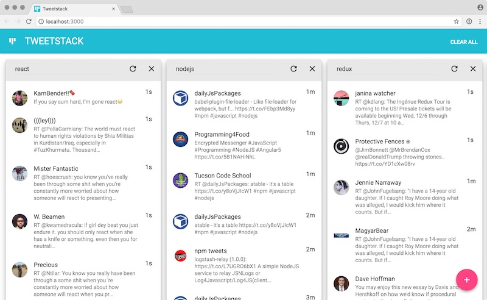

# Tweetstack

Tweestack is a full-stack React/Redux/Nodejs app that lets you create a dashboard of Twitter searches. Each search is called a "stack" simply because as you add them, they stack up.

The search queries are saved in the browser's local storage, so when you return to the app,
the stacks are restored (however fresh data is retrieved from the server).

Have a play feel free to open an issue if you spot something!

## Prerequisites

1. Linux or OSX host

1. This app was built using Nodejs LTS (v8.9.1). There are several ways to install node, however I recommend `nvm`. To get the correct version of node installed, run `nvm install 8.9.1` then `nvm use 8.9.1`. To verify, run `node --version`.

1. Yarn or NPM is also required. Latest versions of each are suitable. NPM `5.x.x` should be installed with Nodejs, and you can install Yarn by running `npm install -g yarn`. Check versions by running `npm --version && yarn --version`. A `yarn.lock` file  is provided so using this is recommend to get the proper package versions.

1. A valid set of Twitter application API keys are required to use the local development server. A configuration script is included to retrieve a bearer token from Twitter given the consumer key and consumer secret, which it prompts for during post install (see below). This is only required if you want to start and use the app locally.

## Installation

1. Clone the repo `git clone https://github.com/ruswerner/tweetstack.git`
1. Install dependencies `yarn` or `npm install`

_NOTE:_ After the app is installed a configuration script will run and prompt for your Twitter API credentials. You can find these here [https://apps.twitter.com/](https://apps.twitter.com/). If you haven't created a Twitter app yet, you can CTRL-C out of the configuration script and re-run it later running `node configure.js`.

## Running the tests

1. `npm test` runs all the tests
1. `npm run test-server` runs the server tests
1. `npm run test-client` runs the client tests
1. `npm run test-jest` runs the client Jest tests (single run)
1. `cd client` then `npm test` will start the Jest runner in watch mode

## Starting the server

1. `npm start` starts both the server and client
1. `npm run server` starts the server on port 3001
1. `npm run client` starts the local webpack server on port 3000 and proxies server-side requests

_NOTE:_ The client code is automatically bundled and served via webpack, so changes are hot-reloaded. The server code is not hot-reloaded, so during development, it's best to start the server separately so it can be cycled without also restarting the client.

## Deployment

Prior to deployment, the production client bundle needs to be generated and committed. 

1. `cd client`
1. `npm run build`
1. commit and push the generated `build` folder (assuming a git-based deployment workflow)

